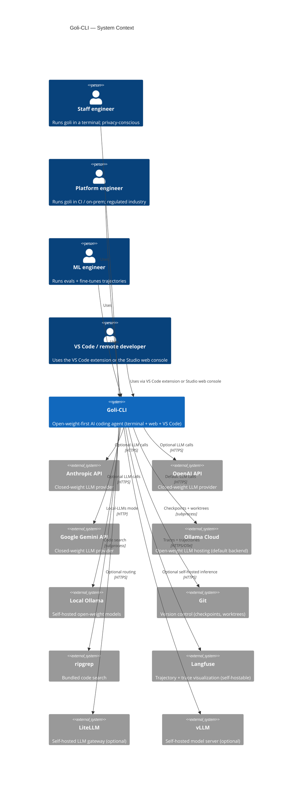
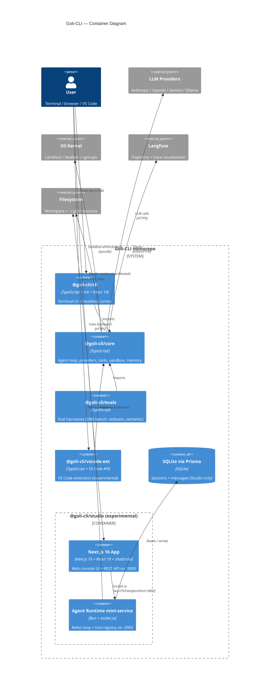
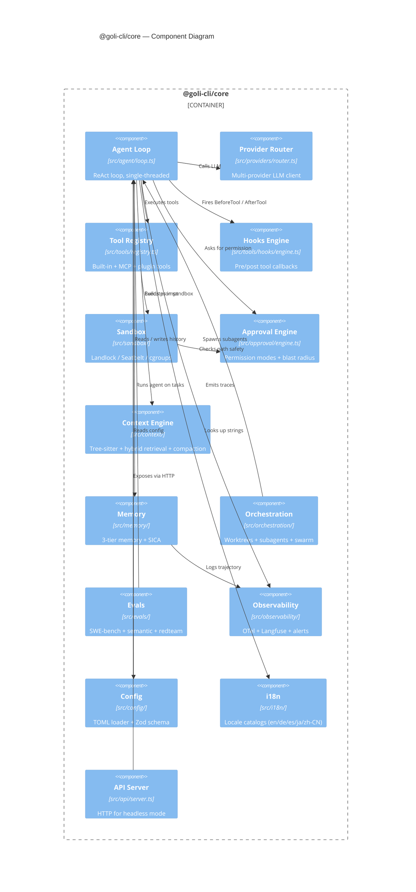
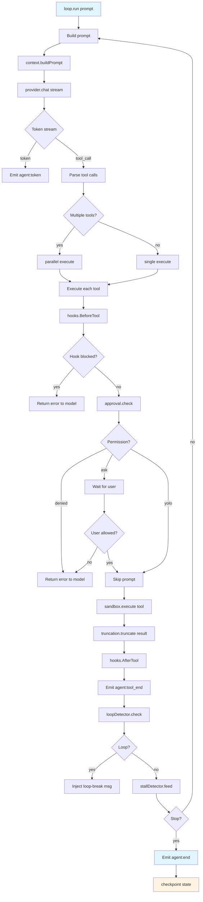
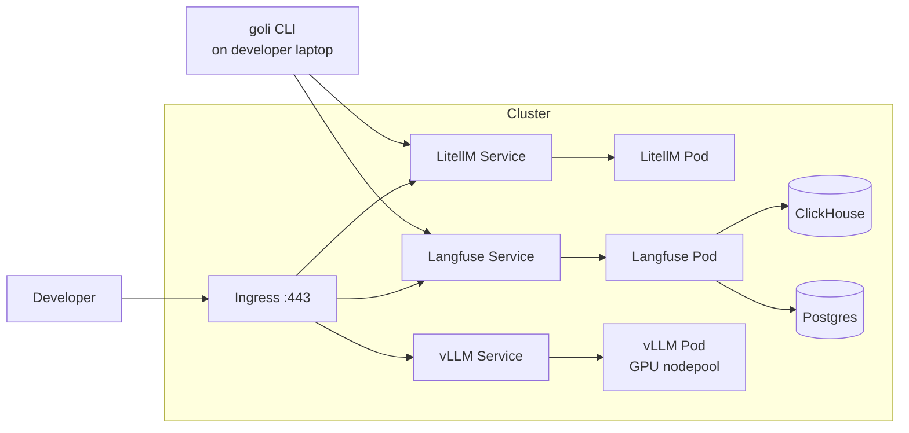
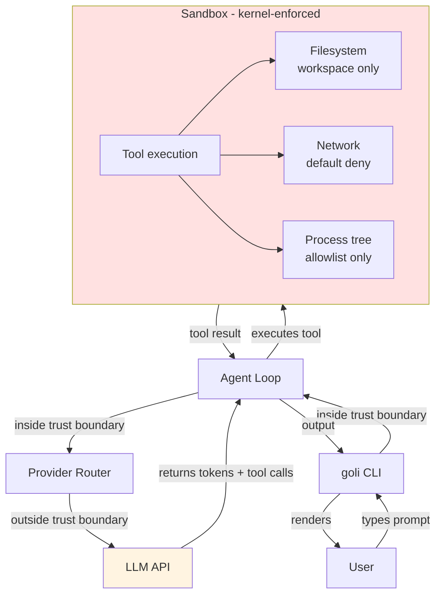

# C4 Architecture Diagrams — Goli-CLI

> **Standard:** [C4 model](https://c4model.com/) by Simon Brown
> **Rendering:** Mermaid (renders natively on GitHub / Obsidian / VS Code)
> **Last updated:** 2026-07-25

This document presents the Goli-CLI architecture at all four C4 levels:
Context, Container, Component, and Code. The diagrams are written in
Mermaid so they render inline in any Markdown viewer that supports
Mermaid (GitHub, GitLab, Obsidian, VS Code with the Mermaid extension).

For a narrative description of the architecture, see
[`sdd.md`](sdd.md). For ADRs backing the decisions visible here, see
[`../decisions/`](../decisions/).

---

## Level 1 — System Context

Shows Goli-CLI in its environment: who uses it and what external systems
it talks to.

### Context notes

- The **default** backend is Ollama Cloud (`ollama/gpt-oss:120b-cloud`); the
  other providers are opt-in via `GOLI_DEFAULT_MODEL`.
- **Local-LLMs mode** (ADR: PII gating + complexity routing) is for
  users who cannot send any prompt to a cloud provider.
- **Langfuse / LiteLLM / vLLM** are deployment-time concerns; the
  `infra/` directory has k8s manifests for self-hosting all three.

---

## Level 2 — Container

Shows the high-level deployable units inside Goli-CLI.

### Container notes

- The **CLI / VS Code / evals** packages all import `@goli-cli/core`.
  They share the agent IP and run in the same process as the user's
  terminal.
- The **Studio** is a separate process model: the Next.js app runs on
  :3000, the agent runtime on :3003, and Caddy bridges them via
  `?XTransformPort`. The studio does **not** import `@goli-cli/core`
  — it re-implements the agent loop in `src/lib/agent/loop.ts` so the
  web bundle stays web-native (no Node-only APIs).
- **SQLite via Prisma** is Studio-only. The CLI uses JSONL files for
  sessions (no Prisma dependency, no native module compilation).

---

## Level 3 — Component

Zooms into `@goli-cli/core` to show its internal modules.

### Component notes

- The **agent loop** is the hub: every other component is called by it,
  never the reverse. This keeps the control flow unidirectional.
- The **hooks engine** sits between the loop and the tools; it can block
  or modify tool calls deterministically (ADR: 0018 hooks-over-prompts).
- The **context engine** owns the prompt-construction budget (ADR: 0025
  hard character budgets) and compaction (ADR: 0023 at 70%).
- The **memory** module is split into 3 tiers + SICA. SICA runs as a
  separate LLM call after each turn, not inline with the loop.

---

## Level 4 — Code (zoom on Agent Loop)

The Code level is typically only drawn for the most critical classes.
Below is the call structure of `agent/loop.ts`'s `run()` method.

### Code-level notes

- The loop is an **async generator** (`async function* run()`). It yields
  `AgentEvent` objects; the consumer (TUI / headless / studio runtime)
  iterates and reacts.
- **Parallel tool execution** (ADR: 0039) uses `Promise.all` with a
  shared `AbortSignal`. If one tool fails, the others are cancelled.
- **Loop detection** (ADR: not formally numbered; see
  `packages/agent-core/__tests__/loop-detector-t065.test.ts`) keeps a sliding window of
  the last 5 tool calls per run; if a hash of (tool name, args) repeats
  5×, the loop is broken.
- **Stall detection** (ADR: see `packages/config/__tests__/stall-detector.test.ts`)
  fires when no token arrives for 30s; it emits a stall event that the
  TUI renders as a "stalled — Ctrl-C to cancel" indicator.
- **Checkpoint** writes the session JSONL + a git checkpoint after every
  turn (ADR: 0024 frozen snapshot injection).

---

## Deployment view (k8s)

For self-hosted deployments (regulated industries, on-prem). The
manifests live in `infra/k8s/`.

### Deployment notes

- **LitellM** is the LLM gateway: it routes model strings to upstream
  providers and adds an audit log.
- **Langfuse** stores traces and trajectories; backed by Postgres +
  ClickHouse.
- **vLLM** serves open-weight models on GPU nodes; the CLI routes to it
  via the OpenAI-compatible client (ADR: 0007).
- All manifests are in `infra/k8s/`: `namespace.yaml`, `litellm.yaml`,
  `langfuse.yaml`, `clickhouse.yaml`, `postgres.yaml`, `vllm.yaml`,
  `secrets.yaml`.

---

## Security view

Trust boundaries and the sandbox.

### Security notes

- The **sandbox is the trust boundary** (ADR: 0001), not the agent. Even
  if the agent is fully compromised by a prompt injection, it cannot
  escape the sandbox.
- **LLM output is untrusted**. Tool calls from the LLM are parsed,
  schema-validated, and checked against the allowlist before execution.
- **Tool results are untrusted** (could contain prompt injection). They
  are truncated (ADR: 0025) and the LLM safety overseer (ADR: 0030)
  reviews them.

---

## Revision history

| Date       | Version | Author          | Change                                                  |
| ---------- | ------- | --------------- | ------------------------------------------------------- |
| 2026-07-13 | v0.1    | Lead Maintainer | Initial C4 diagrams for 0.2.0                           |
| 2026-07-25 | v0.2    | Lead Maintainer | Added Studio containers, security view, deployment view |
